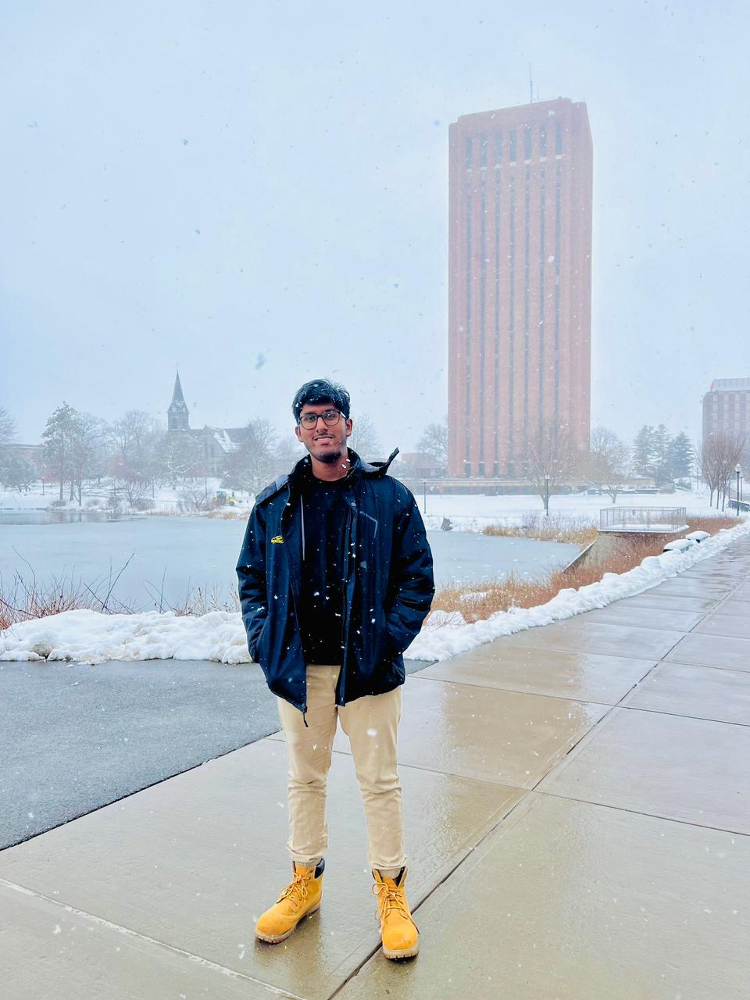

   

     
   

<h1 align="center">Hi there, I'm Anish Shetty! 👋</h1>

  <b>Computer Systems Engineering @ UMass Amherst | Class of 2025</b> 
  <b>Junior Software Developer | Full-Stack (MERN, Django)</b> 
  <b>Cybersecurity Enthusiast | Data Engineering | Cloud Security</b> 
  <b>Curious mind always learning something new</b>

---

### 🏅 Badges & Skills

  
  
  
  
  
  
  
  
  
  
  
  
  
  

---

### 🎓 Education

**University of Massachusetts Amherst**  
_BS in Computer Systems Engineering, Class of 2025_  
Chancellor’s Award Recipient ($48,000 Scholarship)

---

### 💼 Experience

**Infowayz Technologies** — Junior Software Developer _(May 2025 – Present, Boston, MA)_  
- Developed and optimized full-stack web apps (React.js, Node.js, MongoDB)
- Implemented CRM solutions for healthcare, real estate, and education
- Migrated legacy codebases, improved scalability, and supported cloud deployments (AWS/Heroku)

**UMass Amherst Manning CICS** — Undergraduate Course Assistant _(Sept 2023 – May 2025)_  
- Supported 350+ students in CS-250, graded assignments, and simplified complex programming topics

**UMass Residential Life** — Resident Assistant & Student Supervisor _(Aug 2021 – Aug 2025)_  
- Led community development, crisis management, and supervised 20-25 staff

**College of Engineering** — New Student Orientation & Teaching Assistant _(May 2021 – May 2022)_  
- Advised new students, led workshops, and promoted engaging learning environments

---

### 🌟 Projects

- **[RateMyUniversity](#)**: MERN stack web app for university ratings (5,000+ daily submissions, 1TB+ data)
- **[DailyThoughts](#)**: Django journaling app with PostgreSQL & AWS (10,000+ entries, secure auth)
- [Cybersecurity Labs](#): IDS setup, firewall tuning, phishing simulations
- [AWS Cloud Security Compliance](#): IAM, Config, S3 policies for best practices

---

### 🛠️ Technical & Professional Skills

- **Programming:** JavaScript, TypeScript, HTML, CSS, Python, Java, C, C++, MySQL, PostgreSQL, LaTeX, NoSQL
- **Frameworks/Tech:** React, Node.js, MongoDB, Express.js, Springboot, Django, AWS, Postman, Pandas, Pytorch
- **Leadership:** Team management, mentoring, training, conflict resolution, crisis management
- **Teaching:** Workshops, academic support, curriculum development
- **Concepts:** OS, Virtual Memory, Cache, Encryption, AI, ML, Neural Networks, API, Agile, Cloud Computing

---

### 📫 Connect with Me

  
  
  

---

### ⚡ Fun Fact

I automate everything I can, and I love learning new languages—both spoken and coded!

<!--
**adshetty18/adshetty18** is a ✨ _special_ ✨ repository because its `README.md` (this file) appears on your GitHub profile!
-->
